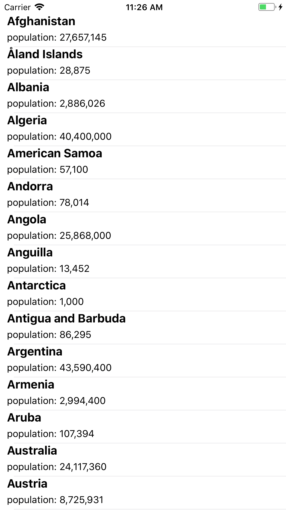
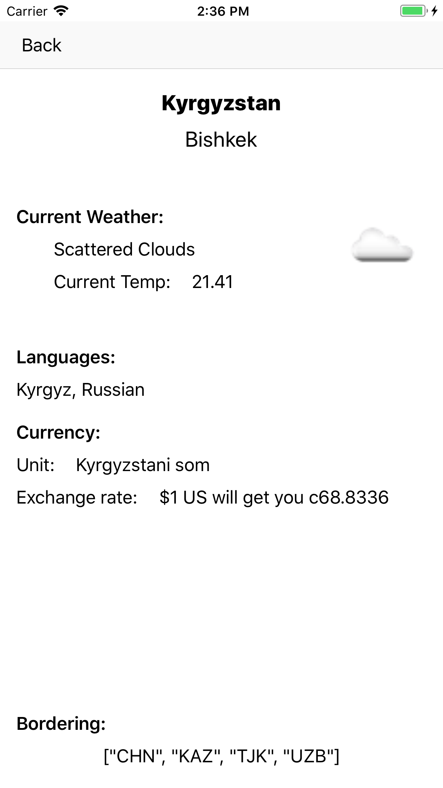

# Premise: Promises 

---

# 👩‍💻 Hi, I'm Anne.  


^ I'm an application developer for Detroit Labs, a mobile services shop in you'll never guess where. I started working in Swift almost immediately and I haven't really looked back since. I'm always trying to dig into the fun corners and interesting bits. 


---

# Why Promises? 

^ So, why have a I gathered you here to talk Promises? Interesting story...

---

## Brace yourself, I'm going to say something nice about JavaScript

^ A couple months ago, a friend of mine was doing a technical interview for a JS position and wanted me to look at his code for the little homework challenge. And he did something that I thought was pretty nifty with a chain of networking calls using Promises. I had been vaguely familiar with the idea of Promises in JS, as in, I knew a thing called Promises existed, but I didn't know much more than that. In that weird serendipitous way of the universe, Swift Weekly or one of those newsletters linked to a newish promises cocoa pod from Google, so I decided to dig in and learn me a thing. 

---

## First stop is always wikipedia 

- First used in 1976-77

^ The term "Promise" to describe a proxy for an unknown result was first proposed in a paper by Daniel Friedman and David Wise in 1976. The idea was expanded upon in another paper in 1977 by Peter Hibbard, though he called it an "Eventual." he terms PROMISE and FUTURE get used interchangeably a lot, but they can mean different things. Generally, a FUTURE is a read-only placeholder, while a PROMISE is write-able single-assignment container that sets the value of a future.

---

## Barbara Liskov is kinda rad 

- First used in 1976-77
- Pipelining/Chaining invented in 1988 

^ Future and Promise constructs were first implemented in MultiLisp and Act 1, but the coolest feature of promises, the ability to pipeline or chain promises, was invented by Barbara Liskov of Liskov Substition Principal fame, and Liuba Shrira in 1988. Although, in their implementation, promises weren't first-class and the language they were working in, Argus, ceased development in 1988. 

---

## y2k revival 

- First used in 1976-77
- Pipelining/Chaining invented in 1988 
- Resurgence of interest in 2000 

^ Promises didn't get much love for the next decade or so, but around the turn of the century there was a major revival in interest in the construct, as web development and the request-response model of messaging took off. Now, most mainstream languages either have native support for some kind of Promise-like business or have frameworks that add support in. 

---

## What is a Promise and why would I want one? 

- represents the the **eventual result** of an asynchronous task 
- or the **error** if that task fails 
- a way of formalizing completion handlers to chain asynchronous tasks 

^ In a very small nutshell, promises are a way to stop caring about when your asynchronous task finishes and lets you carry on as though it already has. It's a representation of either eventual result or an async task, or the error you get if your task fails. And this last bit, about chaining tasks, is the part that really interested me. Async code, particularly network calls, can get to be a real tangled mess. It's the area of an app that tends to be the hardest to understand for new developers on a project, and even for the developers who did the work...and then wandered off to work on other features. 

---


# So I Made An App

^ I learn by doing, so I went ahead and made an app and decided to check out what PromiseKit could do for me. I chose that one because it had been around the longest and so I figured it would have the most documentation. That got me into a little bit of trouble later, but I'll explain that in a few minutes. 


--- 

 

## I hit up the Rest Countries API to get a list of all the countries in the world...

---



## Then I found a weather API and a currency exchange API to play with

---

# CountryList
# View
# Controller 

^ The app has two screens, a country list vc that shows you a tableview of all the countries, and the I get the data for that like this: 

---


``` swift
    func fetchAllCountries(handler:  @escaping ([Country]?) -> ()) {
        guard let url = URL(string: allCountriesURLString) else { return }
        
        let urlRequest = URLRequest(url: url)
        let session = URLSession.shared
        let task = session.dataTask(with: urlRequest, completionHandler: { data, response, error in
            guard error == nil else {
                print("🗺 request error")
                return
            }
            
            guard let responseData = data else {
                print("🗺 data response error")
                return
            }
            
            let countryArray: [Country] = self.decodeAllCountries(countryData: responseData)
            handler(countryArray)
        })
        
        task.resume()
    }
```

^ fetching the country data from the Rest Countries API was pretty straightforward and as expected. Get your URLRequest and your session, start your data task, I used Codable so populating my data models was super easy. I like to keep all my networking business together and out of the view controllers, so I use this pattern of creating a networking class that holds all the actual calls to external APIs. 

---

```swift 
override func viewDidLoad() {
        super.viewDidLoad()
        let networker = Networker()
        
        networker.fetchAllCountries { countries in
            guard let list = countries else { return }
            self.countryList = list
            DispatchQueue.main.async {
                self.tableView.reloadData()
            }
        }
    }
```

^ And over in my CountryListVC, things are still pretty simple and straightforward--get the stuff, update the UI, huzzah. 

---

# Selected Country View Controller

^ Things get a little more complicated in the selected view controller--over there, I need to make three different API calls. One to the currency exchange API, one to the weather API, and then ANOTHER to a different endpoint of the weather API to get the cool weather conditions icon the tells you it was cloudy in Bishkek the day I made these slides. 

--- 

```swift
func fetchCurrentExchangeRate(currencyCode: String, handler:  @escaping (ExchangeRate?) -> ()) {
        guard let currencyURL = URL(string: currencyConversionBaseURLString + currencyAccessKey + "&currencies=\(currencyCode)&format=1") else {
            print("💵 currency url error")
            return
        }
        
        let urlRequest = URLRequest(url: currencyURL)
        let session = URLSession.shared
        let task = session.dataTask(with: urlRequest, completionHandler: { data, response, error in
            
            guard error == nil else {
                print("💵 request error: \(String(describing: error))")
                return
            }
            
            guard let responseData = data else {
                print("💵 data response error")
                return
            }
            
            guard let exchangeRate: ExchangeRate = self.decodeExchangeRateData(currencyData: responseData) else {
                print("💵 decoding error")
                return
            }
            handler(exchangeRate)
            
        })
        
        task.resume()
    }
``` 

^ Again, nothing surprising about how these fetch calls work--they build a URL with the relevant information, get the response and send it over to be decoded. 

--- 

# ↩️ Side Trip! 
## This is why you go to meetups! 

--- 

## Fun with codable 


Botswana Pula | Danish Krone | Polish Złoty
---|---|---
"USDBWP":9.591896 | "USDDKK":6.04103 | "USDPLN":3.388799  

^ so, the relevant part of the currency API response looks like this for the Botswanan Pula, but like this for the Krone and this for the Złoty. You will notice that all of these keys are different. And I wanted to decode all of that to a simple currency struct that looks like this: 

---

## Fun with codable

```swift 
struct Quote: Codable {
    var conversion: String = ""
    var rate: Float = 0.0
}
```

^ Which, okay, with coding keys and a consistent key would have been a breeze! But that key changes depending on the currency being converted. 

---

## Fun with codable

```swift
extension Quote {
    
    struct QuoteKeys: CodingKey {
        var stringValue: String
        var intValue: Int?
        
        init?(stringValue: String) {
            self.stringValue = stringValue
        }
        
        init?(intValue: Int) {
            return nil
        }
    }
    
    public init(from decoder: Decoder) throws {
        let container = try decoder.container(keyedBy: QuoteKeys.self)
        
        for key in container.allKeys {
            self.conversion = key.stringValue
            self.rate = try container.decode(Float.self, forKey: key)
        }
    }
}
```

^ Luckily, I go to Cocoaheads on the regular, and so I saw Priya Rajagopal's talk in March on all the cool things the Codable protocol can do, and she taught us how to create containers to map unknown or varying keys to our codable structs. I literally watched that part of her presentation thinking, "what kind of clown shoe operation can't get their JSON keys together..." and then a week later I was like, "well, shit." 

--- 

# Selected Country View Controller

^ Back to my selected country vc. So the network calls themselves were pretty vanilla and not too exciting. But actually kicking off the request for that data and then updating the UI with the information got a little...interesting. 

--- 

```swift 
private func vanillaNetworkingGetTheStuff() {
        // guard some optional business 

        networker.fetchCurrentExchangeRate(currencyCode: currencyCode) { rate in
            self.exchangeRate = rate
            DispatchQueue.main.async {
                self.setupExchangeRateUI()
            }
        }
        
        networker.fetchCapitalCityWeather(country: country) { weather in
            self.weather = weather
            DispatchQueue.main.async {
                self.setupWeatherUI()
            }
            
            guard let iconCode = self.weather?.conditions.first?.iconCode else {
                print("🌈 error unwrapping icon code")
                return
            }
            self.networker.fetchWeatherIcon(iconCode: iconCode) { weatherImage in
                DispatchQueue.main.async {
                    self.weatherIconImageView.image = weatherImage
                }
                
            }
        }
    }

```

^ So, fun thing. The weather API I was using sends a code for a weather conditions icon--actually, they send you an array of weather conditions but I'm just grabbing the first one because that's a yak I didn't feel like shaving. You can then pass that code into a URL to a different endpoint to get the image. 

--- 

## 🤔 Some concerns 

- Two separate network calls 
- That could end at two different times 
- A third network call that depends on one of the others 

^ Okay, so. We're making three total network calls, one of which depends on the results of the other. And what happens if one of these calls takes a long time? Like, a really long time? Some kind of loading indicator would be great here, but...when do you kick it off? when do you cancel it? Do you nest one call inside the other even though it's unnecessary just so you can have a solid stop on a loading indicator? That seems...less than ideal. Do you have two separate indicators over each part of the UI? That seems excessive and kinda gross. 

---

# Let's Try Promises 

^ So, this is the problem I'm trying to solve with Promises. How do I handle this series of network requests in a way that is elegant, concise, is friendly to the user while they wait for information to load and friendly to me when I come back to this app in six months to add a feature or address a bug? If we pretend this is not a random let's-play-with-APIs hack day app, but an actual production project that makes money and is supported by a team of devs...how can I do this so people who haven't ever been me can quickly grok the code and start building off of it? 


---

## Return a Promise of a type 

```swift
func fetchAllCountries(handler:  @escaping ([Country]?) -> ())
``` 

vs 

```swift 
func promiseFetchAllCountries() -> Promise<[Country]>
``` 

^ I started easy, with the OG fetchAllCountries call. When it was your everyday vanilla networking business, it took a handler that took an array of countries--I was passing in another function, and that function would need an array of country objects. PromiseKit's pattern, and this is common to the entire Promise pattern, returns a Promise object of the type Array-of-Countries. This idea of returning a PROMISE instead of some other more familiar data type took me a few minutes to wrap my head around. What do you do with a promise? How do I go from this Promise to a tableView of countries? 

--- 

## **fulfill** or **reject** 

```swift 
func promiseFetchAllCountries() -> Promise<[Country]> {
        // some url and session business 
        
        return Promise { seal in
            let task = session.dataTask(with: urlRequest) { data, _, error in
                if let responseData = data {
                    let allCountries = self.decodeAllCountries(countryData: responseData)
                    seal.fulfill(allCountries)
                } else if let requestError = error {
                    seal.reject(requestError)
                }
            }
            
            task.resume()
        }
    }
```

^ So what does it mean to return a Promise? And what do you do with that promise? well, you fulfill it or you reject it. Fulfill is the success state, reject is the failure. Fulfill takes a thing of the type you specified in your return value; reject takes an error. If we've got data, we decode it into an array of countries and if we have an error, we reject it with an error type. 

--- 

# ↪️ Side Trip! 

## The March Of Progress vs. The Internet Is Forever 

---

## PromiseKit 6.0 included a major change in the Promise initializer

^ for reasons involving how Sift handles errors in closures. There's a great writeup of their reasoning, and some harsh criticism of Swift, on promieskit.org, I'll let you read up on it at your leisure. 

--- 

## **from** 

```swift 
Promise { fulfill, reject in
    //…
}
``` 

## **to** 

```swift
Promise { seal in
    // ...
}
```

^ The thing is, I chose PromiseKit as the framework I would use to explore promises because it had this long legacy and there were a ton of tutorials and blog posts and whatnot. Alas, they all used the old construction and I lost several hours to swearing at my code and rebooting Xcode in case that was the problem. In fact, not all of PromiseKit's own documentation has been updated to reflect this change. They've got an awesome "cookbook" on their site that has some code samples, and it uses the old initializer.  

--- 

# CountryList View Controller 

^ so, that's what it looks like to return a promise with one network call decoding one set of data into one model. What does that give us on the VC side of things? 

--- 

```swift 
override func viewDidLoad() {
        super.viewDidLoad()
        let networker = Networker()
        
        firstly {
            networker.promiseFetchAllCountries()
        }.done { countryArray in
            self.countryList = countryArray
            self.tableView.reloadData()
        }.catch { error in
            print("📝 some kind of error listing all countries -> \(error)")
        }
    }
```

^ this is where I started to see the fun of--the promise of, if you will--of Promises. What are we doing here? Well, FIRST we are fetching all the countries. when that's DONE we are setting the countryArray6 that we get back and reloading the tableview with the new country array data. We catch the error and handle it in whatever way makes sense. And already, it's addressing something I find super annoying about networking code. 

--- 
 
# 🤲🏻 
## Enter The Circle Of Sharing 
# 🤲🏻

^ We are among friends here. We are all iOS developers, we can in this moment, speak truth to one another in safety. That's what meetups like this are for. So let us know, if only to each other, admit this one truth that we all carry like a stone in our hearts: 

--- 

# `handler` 
# is garbage 

^ you know what I mean. Maybe you call it COMPLETION or something, but it's always the generic, meaningless parameter name for the closure method you are passing in. 

--- 

# I mean, look at this: 

```swift 
func fetchAllCountries(handler:  @escaping ([Country]?) -> ())
```

--- 

# Look at this mess: 

```swift 
func fetchAllCountries(handler:  @escaping ([Country]?) -> ())
```
 
- is this clean code? 

^ one of the fundamental principals of clean code is that names are expressive and descriptive. What is descriptive about handler? It tells you nothing. Which is good because that means it's flexible but bad because what the hell does it ever mean? At least this tells you that whatever handler is handling involves and array of countries. Many times we don't even get that. If you don't know what calls this method you don't know what it is doing--you have to go up a level to see what's going on. 

---

# And what about this: 

```swift 

func duckBusiness() {
    doAThing {
        quackLikeADuck()
    }
}

func doAThing(handler: ()-> ()) {
    doSomeStuff()
    doAnotherThing {
        handler()
    }
}

func doAnotherThing(handler: ()->()) {  
    doSomeMoreThings() 
    handler()
}

```

^ have you ever had to pass a handler THROUGH another function to get to where it needed to be? Like, take the handler from A to C by going through B? We all want to pretend we don't write code like this, but we're in the circle of sharing and we can all admit that sometimes you've backed yourself into this corner. When the zoo calls to say that there's a bug in production and the ducks aren't quacking...this sort of thing is a nightmare to dig through. 

---

# Ugh. It's the worst: 

```swift 
func fetchAllCountries(handler:  @escaping ([Country]?) -> ())
```
 
- is this clean code? 
- chaining is impossible 
- fuckingblocksyntax.com 
**and** 
fuckingclosuresyntax.com

^ AND ANOTHER THING we have TWO entire NSFW websites just dedicated to figuring out how to make this mess in the first place. Nothing about its syntax is intuitive, and I don't know a single person who consistently remembers to put @escaping in there before Xcode yells at them about it. 

--- 

# 🙏🏻 
## Thank you for sharing
# 🙏🏻 

^ Thanks for sharing this moment of honestly, together. 

--- 

## 🚮 Promises handle `handler` 


^ But promises solves this! 

--- 

## Check this out 

```swift
	firstly {
            networker.promiseFetchAllCountries()
        }.done { countryArray in
            self.countryList = countryArray
            self.tableView.reloadData()
        }.catch { error in
            print("📝 some kind of error listing all countries -> \(error)")
        }
```

^ this syntax is way friendlier to my eyes, and way more readable. We first do a thing, then when that thing is done, we do some UI mainthread business, and if there's an error, we deal with it. Everything is clear, I can read this code three months from now, or give it to another developer and there's no mystery to it. 

--- 

## That was easy mode. What about the hard stuff? 

^ That was the simple example, though. A single network call with a single response to deal with. What about my SelectedCountryVC business? Well, it turns out that Promises were even more helpful there! Lemme show you. 

--- 

```swift 
func promiseFetchCurrentExchangeRate(currencyCode: String) -> Promise<ExchangeRate> { 
	... } 

func promiseFetchCapitalCityWeather(country: Country) -> Promise<Weather> { 
	... } 

func promiseFetchWeatherIcon(iconCode: String) -> Promise<UIImage> { 
	... } 
``` 

^ It was straightforward enough to follow my pattern from the fetch countries call get all these to return a promise of the relevant type in that same way. 

---

```swift
firstly {
    when(fulfilled: 
        networker.promiseFetchCurrentExchangeRate(currencyCode: currencyCode), 
        networker.promiseFetchCapitalCityWeather(country: country))
    }.done { exchangeRate, weather in
        self.exchangeRate = exchangeRate
        self.weather = weather

        guard let iconCode = weather.conditions.first?.iconCode else { return }
        self.networker.promiseFetchWeatherIcon(iconCode: iconCode).done { weatherImage in
            self.weatherIconImageView.image = weatherImage
        }
    }.catch { error in
        print("🗺 error in getting the data for \(String(describing: country.name)) -> \(error)")
    }.finally {
        self.setupExchangeRateUI()
        self.setupWeatherUI()
        self.activityIndicator.stopAnimating()
    }
``` 

^ there's a lot going on here, let's break it down 

--- 

## **When** 

```swift 
when(fulfilled: 
    networker.promiseFetchCurrentExchangeRate(currencyCode: currencyCode), 
    networker.promiseFetchCapitalCityWeather(country: country)
)
```

^ "When" is a nifty thing PromiseKit has--most promise libraries have something similar--that takes an array of promises to be fulfilled, in this case the promises of an exchange rate and some weather, and then proceeds only when BOTH have been fulfilled. 

--- 

## **Done** 

```swift
.done { exchangeRate, weather in
        self.exchangeRate = exchangeRate
        self.weather = weather
                
        guard let iconCode = weather.conditions.first?.iconCode else { return }
        self.networker.promiseFetchWeatherIcon(iconCode: iconCode).done { weatherImage in
            self.weatherIconImageView.image = weatherImage
      }
```

^ the DONE block occurs after the first two have been fulfilled--after we already have the information we need from the weather response to go out and get the relevant icon image 

--- 

## **Catch** 

```swift 
.catch { error in
            print("🗺 some kind of error in getting the data for \(String(describing: country.name)) -> \(error)")
        }
``` 

^ If there's an error, it gets caught and dealt with 

--- 

## **Finally** 

```swift 
.finally {
            self.setupExchangeRateUI()
            self.setupWeatherUI()
            self.activityIndicator.stopAnimating()
        }
```

^ And, this FINALLY block is where I can put all the UI work that happens once we have all our data. Including! An! Activity! Indicator! Because that WHEN block is only fulfilled when all its promises are fulfilled, I can kick of an activity indicator at the start of all this mess and know that it will only end when all this is finished. It's useful to the user--showing that a network call is in progress throughout the process and updating the UI all at once and not in pieces. 

--- 

```swift
firstly {
    when(fulfilled:
        networker.promiseFetchCurrentExchangeRate(currencyCode: currencyCode), 
        networker.promiseFetchCapitalCityWeather(country: country))
    }.done { exchangeRate, weather in
        self.exchangeRate = exchangeRate
        self.weather = weather

        guard let iconCode = weather.conditions.first?.iconCode else { return }
        self.networker.promiseFetchWeatherIcon(iconCode: iconCode).done { weatherImage in
            self.weatherIconImageView.image = weatherImage
        }
    }.catch { error in
        print("🗺 error in getting the data for \(String(describing: country.name)) -> \(error)")
    }.finally {
        self.setupExchangeRateUI()
        self.setupWeatherUI()
        self.activityIndicator.stopAnimating()
    }
``` 

^ Put it all together, and you have something that is readable, explicit, and discreet. I feel like I could come back to this code later, or read this code in a new codebase and have a pretty good handle on what's going on. 

--- 

## Wait a second...

```swift
self.networker.promiseFetchWeatherIcon(iconCode: iconCode)
    .done { weatherImage in
        self.weatherIconImageView.image = weatherImage
    }
``` 


^ So, this nested promise. There's supposed to be a better way to do this, PromiseKit has another block--THEN--that should work persuch: 

---

```swift
firstly {    
    when(fulfilled: 
        networker.promiseFetchCurrentExchangeRate(currencyCode: currencyCode), 
        networker.promiseFetchCapitalCityWeather(country: country))
    }.then { exchangeRate, weather in
        self.exchangeRate = exchangeRate
        self.weather = weather
            
        guard let iconCode = weather.conditions.first?.iconcode else { return }
        networker.promiseFetchWeatherIcon(iconCode: iconCode)
    }.done { weatherImage in
        self.weatherIconImageView.image = weatherImage
    }.catch { error in
        print("🗺 error in getting the data for \(String(describing: country.name)) -> \(error)")
    }.finally {
        self.setupExchangeRateUI()
        self.setupWeatherUI()
        self.activityIndicator.stopAnimating()
    }
```

--- 

###❗️`Ambigious reference to member 'firstly(execute:)'`

^ however, despite the fact that this entire construction: firstly, then, done, catch, finally is used all over PromiseKit's documentation, I kept getting this error. In some commentary on the PromiseKit github repo, the owner suggests that you put everything in DONE instead, so I did that, but I don't like it. It doesn't feel...Promise-y, if that makes sense, it feels like the kind of thing Promises are supposed to help you avoid. 

--- 


## 🛠 ➡️ 🧠

## Change your tools, change your mind 


^ Part of what I was going for in the whole experiment with Promises was to try and think about asynchronous code in a new way. The approach you take to solving a problem really depends a lot on what kind of tools you use--the cliche version of this is the Golden Hammer, right? Everything looks like a nail. But really, we do think of different solutions when we use different tools. Our Swift code isn't a google translation of Objective C code, right? We use protocols and structs and all the things Swift gives us to solve a problem in a different, Swift-y way. Nesting that Promise felt kinda gross, and it affected how I felt about Promisekit as a framework. 

--- 

# Pros & Cons 

^ So, this isn't a talk about how Promises are going to solve all your problems, clear your skin, and water your crops. I'm pretty suspicious of anything that claims to be the one answer to all the problems we haven't even seen yet. But it's a tool and and it's always great to add another wrench to the tool box. But, let's be real about the limitations and advantages, right? 

--- 

### 👎🏻 Seems like a lot of overhead for a small project 


^ On the one hand, if you are doing something simple and straightforward, the adjustment of looking at an unexpected pattern might override the gains in readability. Handler might be annoying nonsense, but it's what we know and our used to, right? 

--- 

### 👎🏻 Seems like a lot of overhead for a small project

### 👍🏻 Syntax is clearly more readable 

^ But, if you do have complicated business or are handling a lot of concurrent things, the readability gains might help. I'm thinking of larger projects and codebases and onboarding new developers onto a project already in process. Or coming back to an area you haven't looked at in a while. Networking business usually gets built early in a project and then not really gone back to unless there's a problem. 

---

### 👎🏻 Seems like a lot of overhead for a small project

### 👍🏻 Syntax is clearly more readable 

### 👍🏻 New(ish) idea around an old problem 

^ Like I said earlier, promises aren't a new idea, really. Nor is the problem of having to get from an api response to some UI representation. But we do tend to settle into patterns and ruts. We get used to certain tools and turn to them more frequently. It's good to shake things up every once in a while and to see how a new approach can inspire new ideas. 

--- 

### 👎🏻 Seems like a lot of overhead for a small project

### 👍🏻 Syntax is clearly more readable 

### 👍🏻 New(ish) idea around an old problem 

### 🤜🏻 PromiseKit is...okay 

^ It's the old workhorse, the one that's been around for a while. It has a ton of documentation of its own and a ton of blog posts. That said, that documentation isn't always up to date. It supports Objective C as well, which is cool. It also has some issues with Swift's sometimes cryptic handling of errors within closures. And it lacks some features that other promise frameworks offer. 

--- 

## The other options 

- Google Promises 


^ Google has a promises framework that works a lot like PromiseKit, with a few differences. It also supports ObjC but is lighter weight when adding it to a project. It offers an ALL state and a slightly different WHEN condition--ALL works like PromiseKit's WHEN; Google Promises WHEN is an OR condition, one of more (but not all) of the promises can reject and the WHEN will still be fulfilled. Promisekit's WHEN:FULFILLED errors if one of the promises does and it doesn't really have a similar state for "wait until these promises are resolved either way and then proceed." 

--- 

## The other options 

- Google Promises 
- BrightFutures 

^ Bright Futures want to be the Swift standard promises library, which is a worthy goal. Again, they seem to offer much the same functionality and similar enough implementation of things like THEN and makes interesting us of MAP and FILTER to chain promises. 

---

## The other options 

- Google Promises 
- BrightFutures 
- Hydra 

^ Hydra is another large--in scope and use, not in binary weight--option. They also offer some different and interesting options for handling some or all of your promises failing. 

--- 

# If I had to do it all over again...

^ In the end, I accomplished my goal here. I learned something about Promises, and part of what I learned was that I kinda like them. Would I include a promise framework in my next big client project? Solid Maybe-leaning-Yes. Most of our client apps use API's that are convoluted enough that I think some promise gains can be made. And it's fun to play with new toys. I might give one of the other frameworks a try, though. 

--- 

# Questions❓

---

# Thanks! 

🐦 @northofnormal 
✉️ northofnormal 
💻 github.com/northofnormal/PromisesPromises

^ Thanks for listening to my musings on promises! You can find more musings on twitter, or email me at northofnormal@gmail, or take a look at the code for this countries app on github. 


